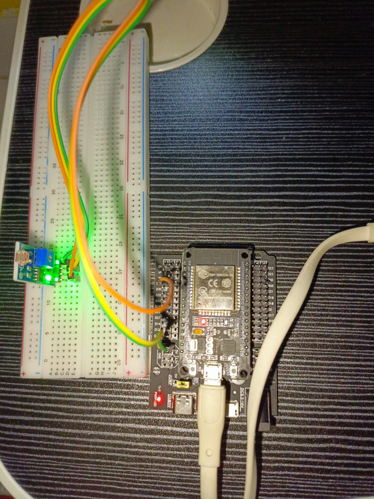

# ESP32-FLASK-LIGHT-SENSOR
Tugas Technical Assignments SIC 2024<br>
Disini saya menggunakan Sensor Cahaya sebagai Inputnya, Esp32 melakukan POST Data, dan Flask menampilkan data yang diterima ke Localhost.

# Identitas Diri
Nama : Muhammad Irshad Al Faqih<br>
Tim  : Enviromind<br>
Asal : MAN 2 Jakarta<br>

# Alat dan bahan
- ESP32
- LDR Sensor (Cahaya)
- Kabel Jumper

# Pin ESP32 TO SENSOR
| Esp32 | LDR Sensor       |
|----------------|------------------|
| 5V / 3V| VCC |
| GND | GND |
| 34 | A0 |
# Foto Rangkaian Fisik


# Program Arduino IDE
Klik tautan berikut untuk melihat kode <br>
[http_post.ino](http_post/http_post.ino)

# Program Python Flask
Program Flask
```python

from flask import Flask, request, render_template, jsonify

app = Flask(__name__)

valsen = {
    "sensor":{
        "light":{
            "value":0
        }
    }
}

@app.route('/sensor', methods=["POST","GET"])
def send_sensor():
    if request.method == "POST":
        tipe = request.form.get("type")
        if tipe == "light":
            valsen["sensor"]["light"]["value"] = int(request.form.get("value"))
        return jsonify(valsen)
    else:
        return jsonify(valsen)
    

@app.route('/', methods=["GET"])
def entry_point():
    return render_template("index.html")

if __name__ == '__main__':
    app.run(host="0.0.0.0",port=5000)
```
Atau bisa lihat pada link berikut : <br>
[myserver.py](myserver.py)


